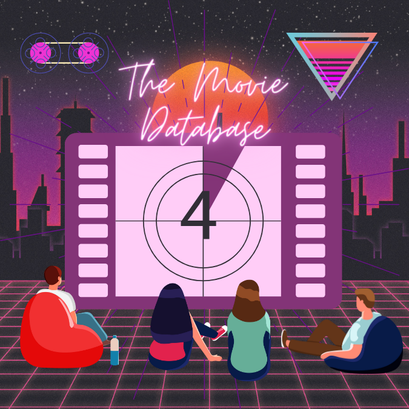

<a name="readme-top"></a>
[![Contributors][contributors-shield]][contributors-url]
[![Issues][issues-shield]][issues-url]

<!-- PROJECT LOGO -->
<br />
<div align="center">
  <a href="https://github.com/Merssith/TMDB-Back-Nest">
    
  </a>

<h3 align="center">THE MOVIE DATABASE - BACKEND (NEST EDITION)</h3>

  <p align="center">
    <br />
    <a href="https://github.com/Merssith/TMDB-Back-Nest"><strong>Explore the docs »</strong></a>
    <br />
    <a href="https://github.com/Merssith/TMDB-Front"><strong>Frontend Repository</strong></a>
    <br />
    <a href="https://github.com/Merssith/TMDB-Back-Nest/issues">Report bug</a>
    ·
    <a href="https://github.com/Merssith/TMDB-Back-Nest/issues">Request feature</a>
  </p>
</div>

<!-- TABLE OF CONTENTS -->
<details>
  <summary>Table of Contents</summary>
  <ol>
    <li>
      <a href="#about-the-proyect">About The Project</a>
      <ul>
        <li><a href="#built-with">Built With</a></li>
      </ul>
    </li>
    <li>
      <a href="#getting-started">Getting Started</a>
      <ul>
        <!-- <li><a href="#prerequisites">Prerequisites</a></li> -->
        <li><a href="#installation">Installation</a></li>
      </ul>
    </li>
    <li><a href="#api-documentation">API Documentation</a></li>
    <li><a href="#roadmap">Roadmap</a></li>
    <li><a href="#contributing">Contributing</a></li>
    <li><a href="#contact">Contact</a></li>
  </ol>
</details>

<!-- ABOUT THE PROJECT -->

## About The Proyect

<!-- <p align="center"></p> -->

This is a web application that allows users to create an account, search the database of movies and TV shows, and create your own favorites lists with this information.<br/>
The project is currently in the development phase.

<p align="right">(<a href="#readme-top">back to top</a>)</p>

### Built With

- NEST
- Mongoose

<p align="right">(<a href="#readme-top">back to top</a>)</p>

<!-- GETTING STARTED -->

## Getting Started

Currently the database is entirely local. Therefore, you will need to follow these instructions to build the backend project.

<!-- ### Prerequisites

You must meet the following pre-requisites to be able to use this project

- DB: Create the DB using psql
  ```sh
  createdb tmdb
  ``` -->

### Installation

1. Clone the repo
   ```sh
   git clone https://github.com/Merssith/TMDB-Back-Nest.git
   ```
2. Install NPM packages
   ```sh
   npm install
   ```
   <!-- 3. Seed database
         ```sh
         npm run seed
         ``` -->
   <!-- 3. Generate the .env file, using as a base the example found in this repository -->
3. Run the server
   ```sh
   npm run start:dev
   ```

<p align="right">(<a href="#readme-top">back to top</a>)</p>

<!-- API  -->

## API Documentation

<p>Currently in development. Check back soon for documentation!</p>

<!-- <p align="center"></p>

Detailed documentation of all API methods can be found <a href="https://documenter.getpostman.com/view/18263083/2s8YzXuKbR" target="_blank">HERE</a>. You can also download the complete [Postman collection](https://api.postman.com/collections/18263083-b6ad1532-24d9-44f3-b3e7-911f5d98fd47?access_key=PMAT-01GMBRCG6ZRG0ZDVPP3AHYZW6C). -->

<p align="right">(<a href="#readme-top">back to top</a>)</p>

<!-- ROADMAP -->

## Roadmap

- [ ] Features for all users
  - [ ] Sign up
  - [ ] Login/Logout
  - [ ] Session persistence
  - [ ] My User profile
  - [ ] User's profile
  - [ ] Search Movie
  - [ ] Search TV Show
  - [ ] Search User
  - [ ] Favorites list: Create, Share, Delete
  - [ ] Movie details
  - [ ] TV Show details
  - [ ] Movie Genres
  - [ ] TV Show Genres
- [ ] Admin features
  - [ ] Delete users
  - [ ] Change roles
  - [ ] Change index carrousel
- [ ] Additional features
  - [ ] Recommendations: TV Shows or Movies based on user preferences
  - [ ] Surprise me: Randomly choose a tv show or movie
  - [ ] Backend monitoring
  - [ ] Email service

<p align="right">(<a href="#readme-top">back to top</a>)</p>

<!-- CONTRIBUTING -->

## Contributing

<p>Contributions from the Dev community help us learn, be inspired, and create new things! All contributions are welcome!</p>
<p>If you have any suggestions to improve our project, please fork the repository and create a pull request. Or You can open an issue.</p>
<p>Thanks again!</p>

1. Fork the Project
2. Create your Feature Branch (`git checkout -b feature/MyFeature`)
3. Commit your Changes (`git commit -m 'Add MyFeature'`)
4. Push to the Branch (`git push origin feature/MyFeature`)
5. Open a Pull Request

<p align="right">(<a href="#readme-top">back to top</a>)</p>

<!-- CONTACT -->

## Contact

- Mercedes Salcedo » [Email](mailto:mercedes.salcedo1989@gmail.com) - [LinkedIn](https://www.linkedin.com/in/mercedessalcedojobs/)

Project Link: [https://github.com/Merssith/TMDB-Back-Nest](https://github.com/Merssith/TMDB-Back-Nest)

<p align="right">(<a href="#readme-top">back to top</a>)</p>

[contributors-shield]: https://img.shields.io/github/contributors/Merssith/TMDB-Back-Nest.svg?style=for-the-badge
[contributors-url]: https://github.com/Merssith/TMDB-Back-Nest/graphs/contributors
[issues-shield]: https://img.shields.io/github/issues/Merssith/TMDB-Back-Nest.svg?style=for-the-badge
[issues-url]: https://github.com/Merssith/TMDB-Back-Nest/issues
